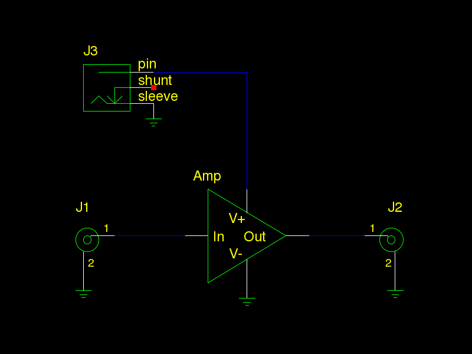
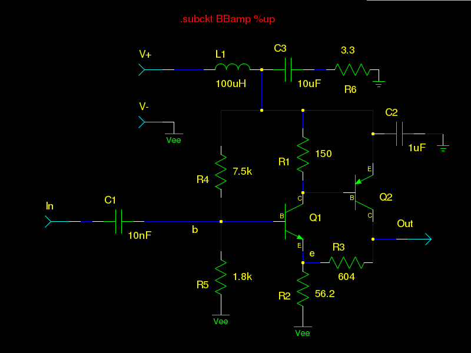
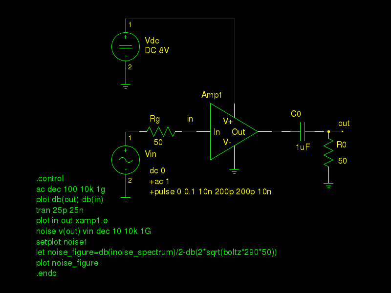

# Simulating a printed circuit project with spice-noqsi and ngspice
The project here is a simple broadband amplifier board. I've organized it in three directories:

* `Schematic` for the board schematics
* `Symbols` for custom symbols
* `Simulation` for test fixtures and models

## Board Schematics
The top level has connectors and a subcircuit for the amplifier itself:

And here's the schematic of the amplifier subcircuit:

The Schematic directory has a suitable gafrc file, telling the tools where custom symbols and subcircuit source files are:

	(source-library ".")
	(component-library "../Symbols")

There's also a Makefile for building a netlist for Osmond PCB, a BOM, and for cleaning up:

	all : Board.osmond Board.bom.tsv

	Board.osmond : Board.sch BBamp.sch
		gnetlist -g osmond Board.sch -o Board.osmond

	Board.bom.tsv : Board.sch BBamp.sch
		gnetlist -g bom Board.sch -o Board.bom.tsv

	clean : 
		rm -f Board.osmond Board.bom.tsv \#* *~

## Simulation
For simulation, this project handles hierarchy in SPICE rather than gnetlist. Thus, in the Simulation directory, there is a
gnetlistrc file containing the line `(hierarchy-traversal "disabled")`. The
`spice-noqsi` back end does not you to use this approach: your project may instead allow gnetlist to
flatten hierarchy and pass the flattened netlist to SPICE. Either approach
works. 

Here's the simulation "test fixture":

To tell `spice-noqsi` to instantiate a subcircuit for the amplifier, the amplifier symbol contains a **spice-prototype=X? %down BBamp** attribute. The **%down** expands into a sorted list of **pinlabel** attributes.  The subcircuit schematic matches this with a top level **spice-prolog=.subckt BBamp %up** attribute. The **%up** expands into a sorted list of the **refdes** attributes of `INPUT`, `OUTPUT`, and `IO` symbols. The result is the same connections as gnetlist makes when it expand hierarchy. You don't need to provide **.ends**: it is automatically appended to the output file.

The amplifier symbol also has a **file=BBamp.cir** attribute. This generates a `.include BBamp.cir` card in the output.

Most other components here use the default prototypes in `spice-noqsi`. Q1 is an exception: its model is a subcircuit, not an elementary device, so it has the attribute **spice-prototype=X? #C #B #E fastnpn** attached.

There is, of course, a Makefile for simulation:

	GNET=gnetlist -g spice-noqsi
	SPICE=ngspice

	%.cir : %.sch
	$(GNET) $< -o $@

	.PHONY : simulation

	simulation : Test.cir BBamp.cir
		$(SPICE) Test.cir transistors.lib

	BBamp.sch : ../Schematic/BBamp.sch
		cp $< $@

	clean : 
		rm -f Test.cir BBamp.cir BBamp.sch \#* *~
		
This makes a copy of `BBamp.sch` in the Simulation directory. I like this approach because I often find myself tinkering with simulation schematics. Since I didn't use the "file=" mechanism to include the transistor models, I explicitly load the model library into SPICE here.

Typing `make` creates three plots: frequency response, transient response, and noise figure.

## Roads not taken

As noted above, it's not necessary to assemble a hierarchical netlist in a Makefile. You can let gnetlist do the expansion. You can also do hierarchy in the style of older SPICE back ends, using `spice-subcircuit-LL` symbols and friends (but that gets in the way of printed circuit layout).

The `Board.sch` schematic could be the simulation test fixture if J1, J2, and J3 had suitable **spice-prototype** attributes to make them sources and loads. There is no need to make the amplifier itself a subcircuit, either.

The approach here is more attuned to larger projects, with multiple subcircuit instances and multiple test fixtures for smaller fragments. For big projects, the modular hierarchical approach has advantages, but this project could possibly benefit from a simpler approach.