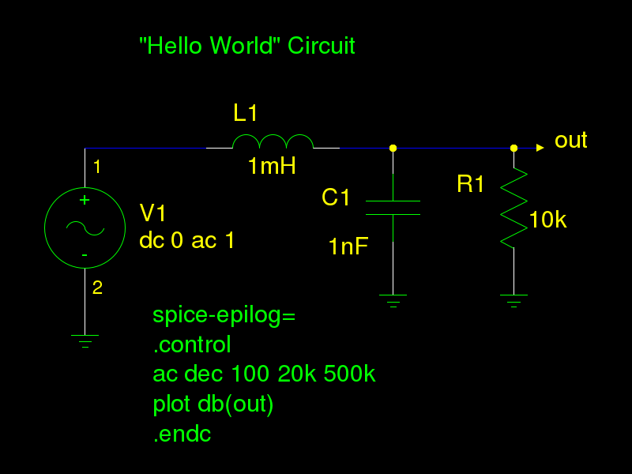

# Getting started using gschem and spice-noqsi to simulate circuits in ngspice

This tutorial assumes you know how to draw circuits in gschem. If not, start with the
[gschem warmup](http://wiki.geda-project.org/geda:gschem_warmup). You'll also need some understanding of ngspice. There are several ngspice tutorials available, for example 
[this one](http://ngspice.sourceforge.net/docs/ngspice-manual.pdf).

Here's a simple circuit, drawn in gschem. The symbols are standard gEDA symbols (vac-1, coil-1, capacitor-1, and resistor-1). The coil, capacitor, and resistor instances have **value** attributes attached.

It also has a multiline *toplevel* attribute:

```
spice-epilog=
.control
ac dec 100 20k 500k
plot db(out)
.endc
```

The easy way to make such an attribute in gschem is to add it as text (AT). The only thing that distinguishes an attribute from ordinary text is the `=` sign, so if you enter the above, it functions as an attribute.

Having saved this as HelloWorld.sch, the terminal command:

	gnetlist -g spice-noqsi HelloWorld.sch -o HelloWorld.cir

creates a SPICE circuit file from the schematic. Here's what HelloWorld.cir looks like:

```
* gnetlist -g spice-noqsi -o HelloWorld.cir HelloWorld.sch
* SPICE file generated by spice-noqsi version 20130710
* Send requests or bug reports to jpd@noqsi.com
C1 GND out 1nF      
L1 1 out 1mH  
R1 GND out 10k      
V1 1 GND dc 0 ac 1

.control
ac dec 100 20k 500k
plot db(out)
.endc
```
Then, the terminal command:

```
ngspice HelloWorld.cir
```

shows this plot.


You'll have to type `quit` at the `ngspice ->` prompt to get back to the command shell. You could put this in the `.control` section above, but then it would just flash the plot at you and close it.

Finally, you can automate the command line operations with a Makefile:

```
HelloWorld : HelloWorld.cir
	ngspice HelloWorld.cir

HelloWorld.cir : HelloWorld.sch
	gnetlist -g spice-noqsi HelloWorld.sch -o HelloWorld.cir

clean : 
	rm -f HelloWorld.cir *~ \#*
```

With the Makefile, `make` or `make HelloWorld` will display the plot. `make clean` will clean up, removing the derived HelloWorld.cir along with temporary files gEDA tends to leave around.